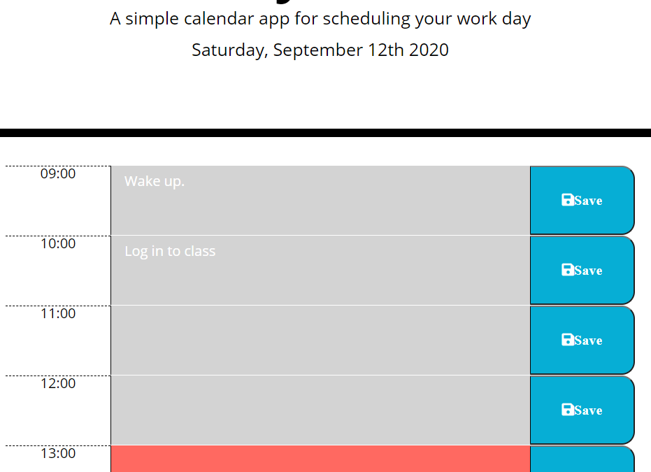

# andrews-calender

## Description 

This repository is a daily planner app to help with scheduling one's work day. It dynamically shows you what time of the work day it is and lists out what you have written down in that hour. It stores what you write down in local storage and displays it when you re-open the app.

[Follow this link to use the app yourself!](https://andrew0502.github.io/andrews-calender/)

## Table of Contents

* [Installation](#installation)
* [Usage](#usage)
* [Credits](#credits)
* [Licenses](#Licenses)

## Installation

Simply clone it off of the git repository, and run it in the browser of your choice.

## Usage 

To use it simply write out what you are doing on any given day and refer back to it when you need to. It will remind you what hour it is by changing color. The current hour block is red the future is green and the past is grey.

## Credits

I would like to thank my classmate Jude Clark, who did a wonderful job of explaining the concepts involved.

## Licenses

"This project is licensed under the terms of the MIT license."